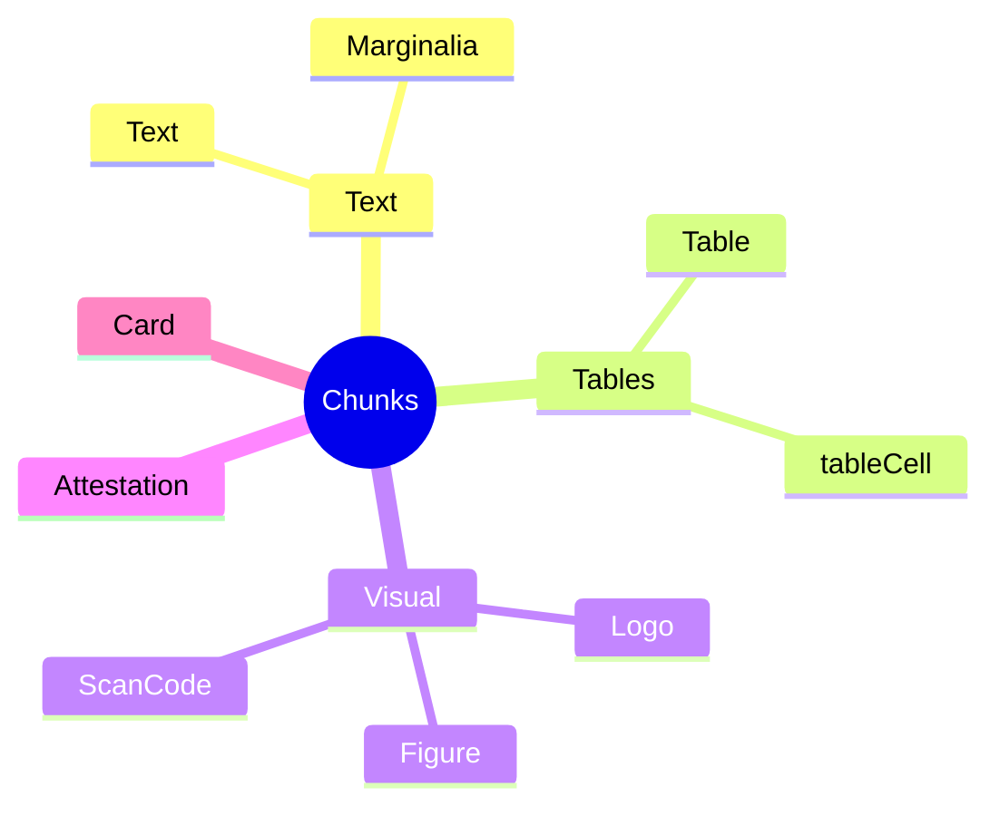
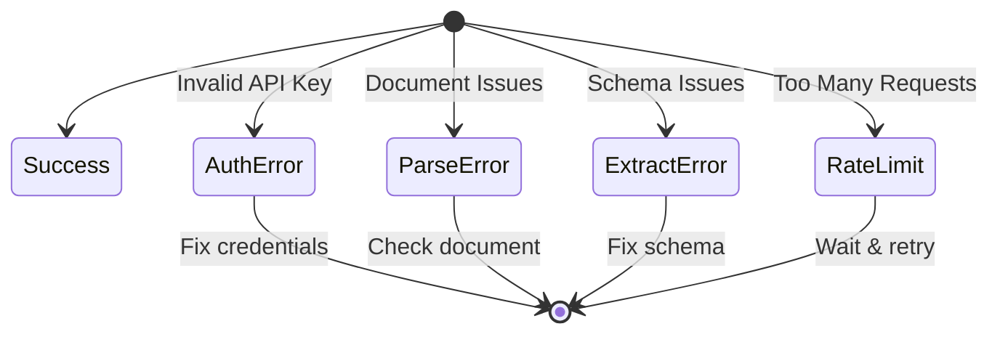

# Visual Concepts Guide

## Table of Contents
- [Understanding Parse Output](#understanding-parse-output)
- [Chunk Types](#chunk-types)
- [Visual Grounding](#visual-grounding)
- [Extraction Schemas Explained](#extraction-schemas-explained)
  - [Pydantic vs JSON Schema](#pydantic-vs-json-schema-the-easy-way)
  - [JSON Schema for Dummies](#json-schema-for-dummies)
- [Async Processing Flow](#async-processing-flow)
- [Error Handling](#error-handling)


## Understanding Parse Output

ParseResponse is the master container returned when you run client.parse(). 

It transforms a chaotic pile of pixels into a structured system where every item is categorized (**chunks**), transcribed (**markdown**), and tracked to its exact original location (**grounding**).

### **The Anatomy of a Parse Response**


| Field | Description | Use Case | Example |
| :--- | :--- | :--- | :--- |
| **`markdown`** | The complete document text formatted as Markdown. | **Feed this to an LLM** (ChatGPT, Claude) to ask questions about the document. | `"# Invoice\nTotal: $500\n<a id='c1'></a>"` |
| **`chunks`** | A list of individual elements (paragraphs, tables, charts). | **Iterate through data.** "Find all tables" or "Extract all logos." | `[{id: "c1", type: "table"}, {id: "c2", type: "text"}]` |
| **`grounding`** | A map linking every chunk ID to exact coordinates (x, y). | **Highlight the source.** Draw a box on the PDF to show users where the answer came from. | `{'c1': {box: {top: 0.1, left: 0.5...}}}` |
| **`splits`** | Organizes chunks by page number. | **Pagination.** "Show me only the text from Page 3." | `[{page: 1, chunks: ['c1', 'c2']}]` |
| **`metadata`** | Job stats (pages processed, credits used, duration). | **Billing & Logging.** Track your usage and performance. | `{duration_ms=5979, credit_usage: 3.0, page_count=1}` |

### Quick Access Example

```python
# 1. Get the object
response = client.parse("invoice.pdf")  # <--- This returns a ParseResponse object

# 2. Access the data using dot notation
print(response.markdown)        # Get the full content
print(response.chunks[0].markdwon)  # Get the content of the first chunk
print(response.metadata)        # See how many credits you used
```


## Chunk Types



## Visual Grounding

```
┌─────────────────────────────┐
│         INVOICE             │
│  ┌──────────────────┐       │
│  │ Invoice #: 001   │←──────┼── Chunk: {type: "text", 
│  └──────────────────┘       │           grounding: {
│                             │             left: 0.1,
│  ┌──────────────────┐       │             top: 0.2,
│  │ Item  │ Price    │←──────┼──           right: 0.6,
│  │────────────────  │       │             bottom: 0.3
│  │ Widget│ $100     │       │           }}
│  └──────────────────┘       │
└─────────────────────────────┘
```

## Extraction Schemas Explained

### Pydantic vs JSON Schema: The Easy Way

Think of it this way:
- **Pydantic** = The friendly Python translator 🐍
- **JSON Schema** = The universal language everyone speaks 🌍

| Aspect | Pydantic (Python-Friendly) | JSON Schema (Universal) |
|--------|---------------------------|------------------------|
| **What it looks like** | Clean Python classes with type hints | Nested dictionaries with strings |
| **Writing experience** | `name: str` | `"name": {"type": "string"}` |
| **IDE Support** | Auto-complete, type checking ✨ | Just a dictionary 📝 |
| **Validation** | Automatic with helpful errors | Manual validation needed |
| **Best for** | Python developers who want comfort | Working across languages/tools |

**Quick Example - Same Thing, Two Ways:**

```python
# Pydantic Way (write this in Python)
class Invoice(BaseModel):
    invoice_number: str
    total: float
    
# JSON Schema Way (what actually gets sent to ADE)
{
    "properties": {
        "invoice_number": {"type": "string"},
        "total": {"type": "number"}
    }
}
```

**Pro Tip:** Use Pydantic in Python, then call `.model_json_schema()` to convert it. Best of both worlds! 🎉

### JSON Schema for Dummies

Think of a **Schema** as a "shopping list" you give to the AI.

If you send the AI a messy document without instructions, it doesn't know what you care about. A schema tells the AI: *"Ignore the noise. Just find these specific things, and give them to me in this specific format."*

#### 1. The Basic Skeleton

Every schema starts the same way. It's a container (an "object") that holds the list of things you want ("properties").

```json
{
  "type": "object",          // This says "I want a bundle of data"
  "properties": {            // "Here is the list of things to find"
                            // ... Your fields go here ...
  }
}
```

#### 2. Defining Your Fields (The "Shopping Items")

For every piece of data you want, you need to tell the AI three things:

1. **Name:** What you want to call it (e.g., `patient_name` instead of just `name`)
2. **Type:** What kind of data is it? (Text? A number? A list?)
3. **Description:** A hint to help the AI find it (e.g., "The total cost in USD, excluding tax")

**The Data Types (Flavors of Data):**
- **`string`**: Plain text (names, descriptions, codes)
- **`number`**: Money or math stuff (decimals allowed)
- **`integer`**: Whole numbers only (no decimals)
- **`boolean`**: True/False (e.g., "Is this checked?")
- **`array`**: A list of things (like line items on a bill)
- **`object`**: A group of related things (like an address)

**A Simple Example:**

```json
{
  "type": "object",
  "properties": {
    "patient_name": {                 // 1. The Name
      "type": "string",               // 2. The Type (Text)
      "description": "Patient name"   // 3. The Hint
    },
    "copay": {
      "type": "number",               // Money = Number
      "description": "Amount paid"
    }
  },
  "required": ["patient_name"]        // "You MUST find this"
}
```

#### 3. Cool Tricks (Advanced Features Simplified)

**Multiple Choice (`enum`)** - Force the AI to pick from your list:
```json
"account_type": {
  "type": "string",
  "enum": ["Checking", "Savings"] 
}
```

**Lists (`array`)** - Grab multiple similar items:
```json
"charges": {
  "type": "array",
  "items": {"type": "string"}  // "Get me a list of strings"
}
```

**Grouping (`object`)** - Keep related data together:
```json
"invoice": {
  "type": "object", 
  "properties": {
     "number": {"type": "string"},
     "total": {"type": "number"}
  }
}
```


## Error Handling



## Next Steps

- **[Examples](examples.md)** - See these concepts in code
- **[Recipes](recipes.md)** - Production implementations