# Visual Concepts Guide

## Table of Contents
- [Split vs Extract Decision Tree](#split-vs-extract-decision-tree)
- [Parse Output Visualization](#parse-output-visualization)
- [Understanding Parse Output - Beginner's Guide](#understanding-parse-output---beginners-guide)
- [Chunk Types](#chunk-types)
- [Visual Grounding](#visual-grounding)
- [Schema Structure](#schema-structure)
- [Confidence Scores](#confidence-scores)
- [Async Processing Flow](#async-processing-flow)
- [Model Selection](#model-selection)
- [Save Options](#save-options)
- [Error Handling](#error-handling)

## Split vs Extract Decision Tree


## Parse Output Visualization

```mermaid
graph LR
    subgraph "Original Document"
        DOC[📄 PDF/Image]
    end
    
    subgraph "Parse Result"
        MD[📝 Markdown Text]
        CH1[📦 Text Chunk]
        CH2[📊 Table Chunk]
        CH3[🖼️ Figure Chunk]
    end
    
    DOC --> MD
    DOC --> CH1
    DOC --> CH2
    DOC --> CH3
```



## Understanding Parse Output - Beginner's Guide

Think of parsing a document like organizing a messy desk: you sort papers into categories, transcribe handwritten notes, and track where everything came from.

### The 5 Main Parts of Parse Output

| Field | What It Is | Real-World Analogy | Example |
|-------|------------|-------------------|---------|
| **chunks** | Individual pieces of content | Like cutting a newspaper into articles | `[{type: "text", content: "Invoice #123"}, {type: "table", content: ...}]` |
| **markdown** | Clean text version of entire document | Like retyping handwritten notes | `"# Invoice\nInvoice Number: 123\nTotal: $500"` |
| **metadata** | Document information | Like a file's properties (size, date, etc.) | `{pages: 3, duration: 2.5s, credits_used: 1}` |
| **splits** | Organized by page/section | Like dividers in a binder | `[{page: 1, chunks: [...]}, {page: 2, chunks: [...]}]` |
| **grounding** | Location of each piece | Like GPS coordinates for text | `{chunk_id: {left: 0.1, top: 0.2, right: 0.5, bottom: 0.3}}` |

### Simple Visual Example

```
Your PDF Document              →    Parse Output
┌─────────────┐                    ┌────────────────────┐
│ Title       │                    │ chunks: [          │
│             │                    │   "Title text",    │
│ ┌─────────┐ │       Parse        │   "Table data",    │
│ │ Table   │ │      ------>       │   "Image caption"  │
│ └─────────┘ │                    │ ]                  │
│             │                    │                    │
│ [Image]     │                    │ markdown:          │
└─────────────┘                    │ "# Title\n..."     │
                                   └────────────────────┘
```

### Quick Access Example

```python
# After parsing a document
response = client.parse(document="invoice.pdf")

# Access the clean text
print(response.markdown)  # "Invoice #123\nDate: 2025-01-12\n..."

# Count content pieces
print(f"Found {len(response.chunks)} pieces")  # "Found 15 pieces"

# Check pages
print(f"Document has {len(response.splits)} pages")  # "Document has 3 pages"

# Get processing info
print(f"Took {response.metadata['duration']} seconds")  # "Took 2.5 seconds"
```

## Chunk Types


## Visual Grounding

```
┌─────────────────────────────┐
│         INVOICE             │
│  ┌──────────────────┐       │
│  │ Invoice #: 001   │←──────┼── Chunk: {type: "text", 
│  └──────────────────┘       │           grounding: {
│                             │             left: 0.1,
│  ┌──────────────────┐       │             top: 0.2,
│  │ Item  │ Price    │←──────┼──           right: 0.6,
│  │────────────────  │       │             bottom: 0.3
│  │ Widget│ $100     │       │           }}
│  └──────────────────┘       │
└─────────────────────────────┘
```

## Schema Structure

```mermaid
graph TD
    subgraph "Pydantic Model"
        PM[class Invoice:<br/>invoice_number: str<br/>total: float]
    end
    
    subgraph "JSON Schema"
        JS[{<br/>'properties': {<br/>'invoice_number': {'type': 'string'},<br/>'total': {'type': 'number'}<br/>}<br/>}]
    end
    
    subgraph "Extracted Data"
        ED[{<br/>'invoice_number': 'INV-001',<br/>'total': 1250.00<br/>}]
    end
    
    PM -->|.model_json_schema()| JS
    JS -->|extract()| ED
```

## Confidence Scores


## Async Processing Flow


## Model Selection


## Save Options

```mermaid
graph LR
    subgraph "Parse with save_to"
        PARSE[client.parse(<br/>document='doc.pdf',<br/>save_to='./output')]
    end
    
    subgraph "Output Files"
        JSON[doc_parse_output.json]
        MD[doc_markdown.txt]
    end
    
    PARSE --> JSON
    PARSE --> MD
```

## Error Handling


## Next Steps

- **[Examples](examples.md)** - See these concepts in code
- **[Recipes](recipes.md)** - Production implementations