# Visual Concepts Guide

## Table of Contents
- [Understanding Parse Output](#understanding-parse-output)
- [Chunk Types](#chunk-types)
- [Visual Grounding](#visual-grounding)
- [Schema Structure](#schema-structure)
- [Confidence Scores](#confidence-scores)
- [Async Processing Flow](#async-processing-flow)
- [Model Selection](#model-selection)
- [Save Options](#save-options)
- [Error Handling](#error-handling)


## Understanding Parse Output

ParseResponse is the master container returned when you run client.parse(). It transforms a chaotic pile of pixels into a structured system where every item is categorized (**chunks**), transcribed (**markdown**), and tracked to its exact original location (**grounding**).

### **The Anatomy of a Parse Response**


| Field | Description | Use Case | Example |
| :--- | :--- | :--- | :--- |
| **`markdown`** | The complete document text formatted as Markdown. | **Feed this to an LLM** (ChatGPT, Claude) to ask questions about the document. | `"# Invoice\nTotal: $500\n<a id='c1'></a>"` |
| **`chunks`** | A list of individual elements (paragraphs, tables, charts). | **Iterate through data.** "Find all tables" or "Extract all logos." | `[{id: "c1", type: "table"}, {id: "c2", type: "text"}]` |
| **`grounding`** | A map linking every chunk ID to exact coordinates (x, y). | **Highlight the source.** Draw a box on the PDF to show users where the answer came from. | `{'c1': {box: {top: 0.1, left: 0.5...}}}` |
| **`splits`** | Organizes chunks by page number. | **Pagination.** "Show me only the text from Page 3." | `[{page: 1, chunks: ['c1', 'c2']}]` |
| **`metadata`** | Job stats (pages processed, credits used, duration). | **Billing & Logging.** Track your usage and performance. | `{duration_ms=5979, credit_usage: 3.0, page_count=1}` |

### Quick Access Example

```python
# 1. Get the object
response = client.parse("invoice.pdf")  # <--- This returns a ParseResponse object

# 2. Access the data using dot notation
print(response.markdown)        # Get the full content
print(response.chunks[0].markdwon)  # Get the content of the first chunk
print(response.metadata)        # See how many credits you used
```


## Chunk Types


## Visual Grounding

```
┌─────────────────────────────┐
│         INVOICE             │
│  ┌──────────────────┐       │
│  │ Invoice #: 001   │←──────┼── Chunk: {type: "text", 
│  └──────────────────┘       │           grounding: {
│                             │             left: 0.1,
│  ┌──────────────────┐       │             top: 0.2,
│  │ Item  │ Price    │←──────┼──           right: 0.6,
│  │────────────────  │       │             bottom: 0.3
│  │ Widget│ $100     │       │           }}
│  └──────────────────┘       │
└─────────────────────────────┘
```

## Schema Structure

```mermaid
graph TD
    subgraph "Pydantic Model"
        PM[class Invoice:<br/>invoice_number: str<br/>total: float]
    end
    
    subgraph "JSON Schema"
        JS[{<br/>'properties': {<br/>'invoice_number': {'type': 'string'},<br/>'total': {'type': 'number'}<br/>}<br/>}]
    end
    
    subgraph "Extracted Data"
        ED[{<br/>'invoice_number': 'INV-001',<br/>'total': 1250.00<br/>}]
    end
    
    PM -->|.model_json_schema()| JS
    JS -->|extract()| ED
```

## Confidence Scores

```mermaid
graph LR
    subgraph "Extraction Result"
        DATA[Data]
        CONF[Confidence]
    end
    
    subgraph "Confidence Levels"
        HIGH[🟢 0.9-1.0: High]
        MED[🟡 0.7-0.9: Medium]
        LOW[🔴 0.0-0.7: Low]
    end
    
    DATA --> HIGH
    DATA --> MED
    DATA --> LOW
```



## Async Processing Flow


## Model Selection


## Save Options

```mermaid
graph LR
    subgraph "Parse with save_to"
        PARSE[client.parse(<br/>document='doc.pdf',<br/>save_to='./output')]
    end
    
    subgraph "Output Files"
        JSON[doc_parse_output.json]
        MD[doc_markdown.txt]
    end
    
    PARSE --> JSON
    PARSE --> MD
```

## Error Handling


## Next Steps

- **[Examples](examples.md)** - See these concepts in code
- **[Recipes](recipes.md)** - Production implementations